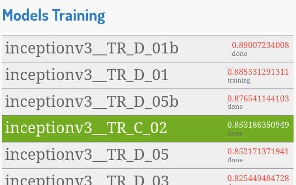
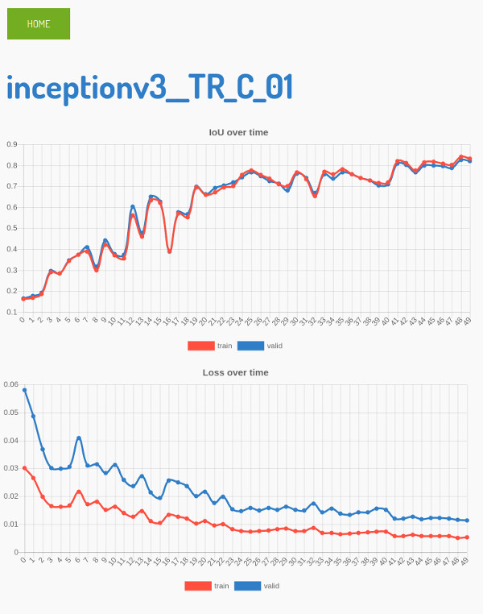

# Model Nanny

Monitor the progress of training models.

**TODO:** Add a description for this project

**TODO:** Add description of required files and directory structure

**TODO:** Add description of dependencies

**TODO:** Add screenshots

## Installing Flask

```sh
# ===============================================
# INSTALLING FLASK
# ===============================================
sudo apt-get update
sudo apt-get install -y python-pip python3-pip
pip install --upgrade pip
pip3 install --upgrade pip
pip install Flask
pip3 install Flask
```

## Running Model Nanny

```sh
# ===============================================
# ON COMPUTER HOSTING THE TRAINING MODELS
# ===============================================
PROJECT_DIR="/path/to/project"
cd ${PROJECT_DIR}/model_nanny
export FLASK_APP=microserver.py
flask run --host=0.0.0.0 --port=8080

# Maybe add --threaded=True as an argument to `flask run` if its slow and unresponsive
#  - Actually this doesnt work frm command line - look for a workaround.
```


# Screenshots
Main page that allows you to monitor the status of the model and the best
score achieved by each model being trained (sorted by by performance).


When you click on a model, you enter the model page, that gives you detailed
plots that track the performance over time.


